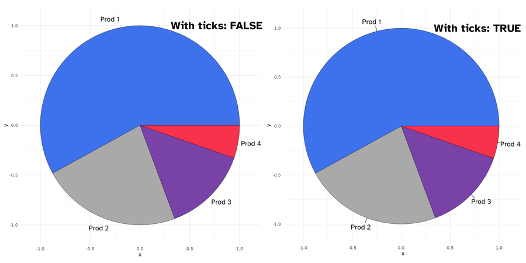

<!-- README.md is generated from README.Rmd. Please edit that file -->

# ggtricks <a href="https://abdoulma.github.io/ggtricks/"></a>

```{r, include = FALSE}
knitr::opts_chunk$set(
  echo = TRUE,
  collapse = TRUE,
  message = FALSE, 
  warning = FALSE,
  error = FALSE,
  cache = TRUE,
  fig.retina = 2,
  comment = "#>",
  fig.path = "man/figures/README-",
  out.width = "100%"
)
```

# ggtricks

<!-- badges: start -->
[](https://CRAN.R-project.org/package=ggtricks)
[](https://app.codecov.io/gh/AbdoulMa/ggtricks?branch=main)
<!-- badges: end -->

**{ggtricks}** package is a collection of multiple geom  presenting data in the form of  circle (at the moment, but many more to come and not only circle oriented.) using grammar of graphics philosophy and Cartesian coordinates system.

You have bench of functions to make sector charts where  circle is divided along it radii,
so each section is proportional to value it represents.

* `geom_pie` Pie charts 
* `geom_donut` Donut charts (Pie chart with a hole)
* `geom_slice` Part of Pie charts
* `geom_donut_slice` Part of Donut charts 

You also have a function, `geom_series_circles()` to draw what I call series of circles, which  draws for a category as many circles and fraction of circles needed to represent the value represented by this category. A companion function `geom_series_text` is defined to put labels at limit of series circles as computing this limits positions can be tedious depending on fragments of circles starting angle.

## Installation

You can install the development version of ggtricks like so:

```r
install.packages("ggtricks")
# or 
devtools::install_github("abdoulma/ggtricks")
```

```{r s2, include=FALSE}
options(width=120)
```

## Examples 

###  `geom_series_circles`

- Basic Example
```{r}
library(tidyverse)
library(ggtricks)
prod_df <- data.frame(
  good = c("Chicken", "Eggs", "Meats"), 
  inflation = c(2.275, 8.5, 3.85)
)

prod_df <- prod_df |> 
  mutate(good = fct_reorder(good, inflation))

prod_df |>
  ggplot() + 
  geom_series_circles(aes(inflation, good), color = "white", linewdith = 2.5) + 
  coord_equal() + 
  theme_minimal()
```

Of course, there are a mapping argument `fill` to  drive each category filling color.

```{r}
prod_df |>
  ggplot() + 
  geom_series_circles(aes(inflation, good, fill = good),color = "black", linewdith = 2.5) + 
  coord_equal() + 
  theme_minimal()
```

Of course, you can choose, to customize the categories labels by setting `axis.text` in `theme_*()` function.   But the need can come to add labels at series of circles ending positions. There comes `geom_series_text()` functions.

```{r}
prod_df |>
  ggplot() + 
  geom_series_circles(aes(inflation, good, fill = good),color = "black", linewdith = 2.5) + 
  geom_series_text(aes(inflation, good, label = inflation)) + 
  coord_equal() + 
  theme_minimal()
```

You can set `init_angle` to define fragment of circle starting angle.

```{r, eval=FALSE}
index_df <- tribble( 
  ~article, ~index, 
  "Plate beef", 187, 
  "Bacon", 215, 
  "Lard", 266
  )

index_df <- index_df |> 
  mutate(
    index =  index / 100
  )

index_df |> 
  ggplot() + 
  geom_series_circles(aes(index, article),
                      init_angle = 45
                      # init_angle = 90
                      # init_angle = 145
                      # init_angle = 180
                      ) + 
  coord_equal() +
  theme_minimal()
```

<!-- TODO Put the facet
 -->

- Two  series of circles combination

###  `geom_pie` 
- `init_angle`
As for `geom_series_circles()`, you can set the init angle parameter to define the starting angle of you pie (here the `pie`, but it is also available for `donut`, `slice` and `donut_slice`.)

```{r}
my_df <- data.frame(
  cat = paste0("Prod ",  1:4), 
   val = c( 87,34,21,8)
)

categories_fills <- c(
  "Prod 1" = "#3E71EC",
  "Prod 2" = "#A9A9A9",
  "Prod 3" = "#7942A6",
  "Prod 4" = "#F7324B"
)
```


```{r, eval=FALSE}
my_df |>
  ggplot() + 
  geom_pie(aes(cat = cat, val = val, fill = cat), 
            init_angle = 0
            # init_angle = 60,
            # init_angle = 120,
            # init_angle = 180
           ) + 
  coord_equal() +
  scale_fill_manual(
    values = categories_fills
  ) +
  theme_minimal()
```


-  `spotlight_max` & `spotlight_position`
If you want the category with the max value to drive the slices positions, you cant set the `spotlight_max` parameter to `true`. Then the category with the max value will be placed at `spotlight_position` (default `top`, others possibles values are: `right`, `bottom` and `left`.)

```{r, eval=FALSE}
my_df |>
  ggplot() + 
  geom_pie(aes(cat = cat, val = val), spotlight_max = TRUE,
           spotlight_position = "top",
           # spotlight_position = "right"
           # spotlight_position = "bottom"
           # spotlight_position = "left"
  ) + 
  coord_equal() + 
  scale_fill_manual(
    values = categories_fills
  ) +
  theme_minimal()
```


- `spotlight_cat`
Maybe, you want specific category to drive the slices positions rather than the category with the max value ? 
Then come the `spotlight_cat` parameter to define the driving category. Here too, you can combine the  `spotlight_cat` parameter value with `spotlight_position` to specify its position.

```{r}
my_df |>  
  ggplot() + 
  geom_pie(aes(cat = cat, val = val, fill = cat),
           spotlight_cat = "Prod 1",
           spotlight_position = "top"
           ) +
  coord_equal() + 
   scale_fill_manual(
      values = categories_fills, 
      guide = "none"
    ) +
  theme_minimal()
```


- `labels`

As I know that it can be tricky to know the coordinates of the positions of the center of categories slices, I define a  default mapping `labels` that will place the provided labels at that position. When `labels` mapping is defined, you can set `labels_with_tick` 
parameters to `TRUE` to add ticks at slices centers positions. 

```{r, eval=FALSE}
my_df |> 
  ggplot() + 
  geom_pie(aes(cat = cat, val = val, fill = cat, label = cat)
           # labels_with_ticks = TRUE
           ) + 
  coord_equal() + 
   scale_fill_manual(
      values = categories_fills, 
      guide = "none"
    ) +
  theme_minimal()
```


 
###  `geom_donut`

Donut is just pie with an hole. There are two parameters `r1` and `r2` to set donut thickness. 

```{r, eval=FALSE}
my_df |> 
  ggplot() + 
  geom_donut(aes(cat = cat, val = val, fill = cat), 
           r1 =  1 , r2 = .65      
           # r1 =  1 , r2 = .35
           ) + 
  coord_equal() + 
   scale_fill_manual(
      values = categories_fills, 
      guide = "none"
    ) +
  theme_minimal()
```


All the others parameters available for `geom_pie` are here too. 

###  `geom_slice`

It is a portion of pie, by default an half (180 deg). You can set the `slice_angle`  portion yo fit your need. 

```{r, eval = FALSE}
my_df |> 
  ggplot() + 
  geom_slice(aes(cat = cat, val = val, fill = cat), 
             slice_angle = 180#,
             # slice_angle = 120 
             ) + 
  coord_equal() + 
   scale_fill_manual(
      values = categories_fills, 
      guide = "none"
    ) +
  theme_minimal()
```


Here too, you can set the starting angle position  with `init_angle`. 
Note here that there are not `spotlight_max`, `spotlight_cat`  parameters, as we are not drawing a complete circle (but theoretically you can, if you set `slice_angle` to 360, which means a `pie`.)

```{r, eval=FALSE}
my_df |> 
  ggplot() + 
  geom_slice(aes(cat = cat, val = val, fill = cat), 
             init_angle = 30#,
             # init_angle = 90 
             ) + 
  coord_equal() + 
   scale_fill_manual(
      values = categories_fills, 
      guide = "none"
    ) +
  theme_minimal()
```


You can however set the slice position with `slice_position`(possible values are: `top`, `right`, `bottom`, and `left`). 
Soon, I  will post more detailed examples on the package website : <https://www.abdoulma.github.io/ggtricks>. 

###  `geom_donut_slice`

It is a slice of donut plot. As `geom_donut`, it is driven by 2 radii and as a slice plot, it has a defined slice angle. 

```{r, eval=FALSE}
my_df |> 
  ggplot() + 
  geom_donut_slice(aes(cat = cat, val = val, fill = cat), 
             r1 = 1, r2  = .65
             # r1 = 1, r2  = .35,
             # slice_angle = 90 
             # slice_angle = 120 
             # slice_angle = 180 
             ) + 
  coord_equal() + 
   scale_fill_manual(
      values = categories_fills, 
      guide = "none"
    ) +
  theme_minimal()
```


`geom_slice_donut` has also special parameter `link_with_origin`,if you want to connect the donut slice limits with origin. 

```{r}
my_df |> 
  ggplot() + 
  geom_donut_slice(aes(cat = cat, val = val, fill = cat), 
             r1 = 1, r2  = .65,
             slice_angle = 120,
             slice_position = "top",
             link_with_origin = TRUE
             ) + 
  coord_equal(clip = "off") +
   scale_fill_manual(
      values = categories_fills, 
      guide = "none"
    ) +
  theme_minimal()
```


## Limitations

As you surely noted, to generate circle, I use `coord_equal()`, using `coord_cartesian()` will  zoom the plot, not generating a appealing circle shape even if the underlying drawn plot is a plot. So, we fix, the `aspect ratio` to force :

> the physical representation of data units on the axes.

according to the official [documentation](https://ggplot2.tidyverse.org/reference/coord_fixed.html). 
Of course, you shouldn't edit the default `ratio = 1` that ensures that one unit on `x-axis` is the same length as one unit on the `y-axis`.

When using `geom_serie_circle()`, the desire will come one day to combine it with `facet_wrap()` or `facet_grid` or whatever faceting function, **you should not**, or not in the way you are thinking about.

As we use `coord_equal()`, you won't be able to set `scales` parameter, what I strongly suspect you to try to do. So for the moment, I don't recommend you to do so.
Although, I will give some tips to go through those restrictions on package website <https://www.abdoulma.github.io/ggtricks>

## Roadmap

In the following weeks, additional features will be added to current `geoms`: 

- Detach spotlighted category
- Variate radius for categories representation
- Label displaying in mapping (choose categories we want to display)
- Special key draw for pie and slice and another one for `donut` and `donut_slice`.

As announced at start, I don't limit the package to sector charts, so additional `geom` styles will be added, and if you have suppositions, fee free to open an issue, I am open to all contributions.
