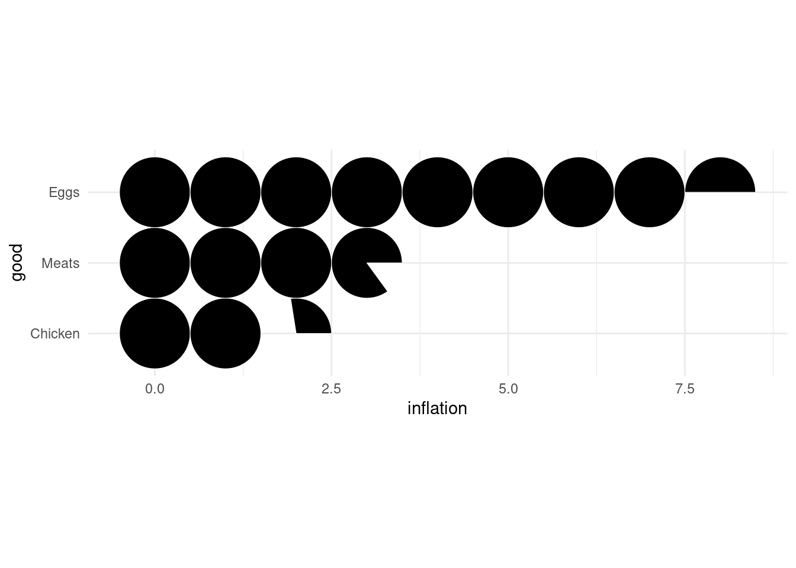
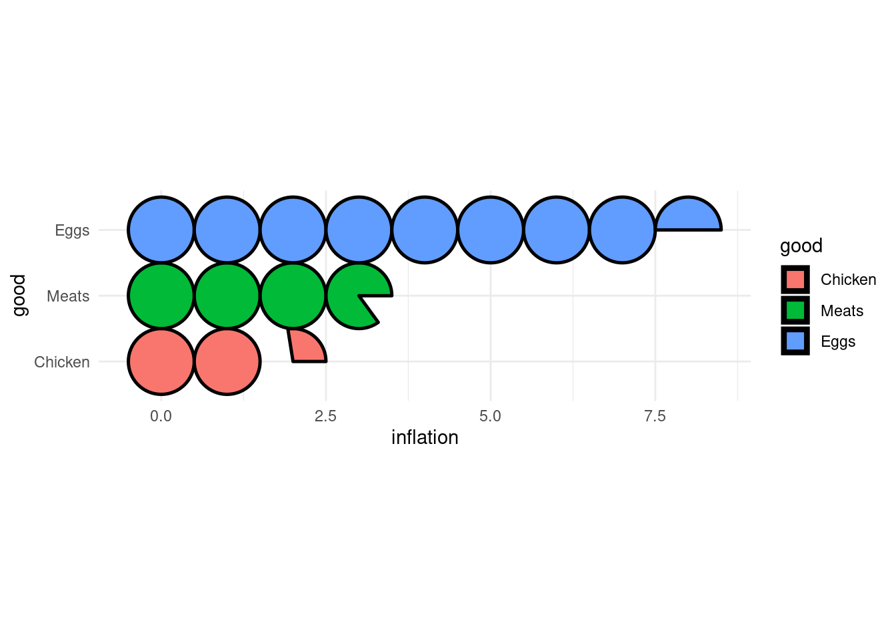
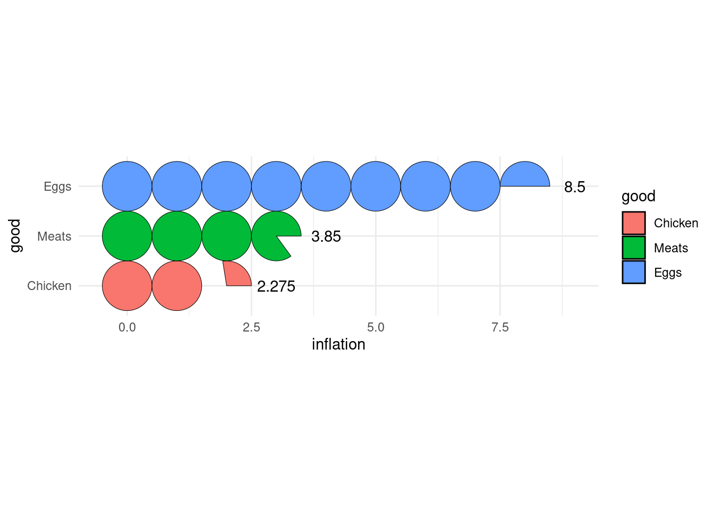

<!-- README.md is generated from README.Rmd. Please edit that file -->

# ggtricks

<!-- badges: start -->

[](https://CRAN.R-project.org/package=ggtricks)
[](https://app.codecov.io/gh/AbdoulMa/ggtricks?branch=main)
<!-- badges: end -->

{ggtricks} package is a collection of multiple geom presenting data in
the form of circle (at the moment, but many more to come and not only
circle oriented.) using grammar of graphics philosophy and Cartesian
coordinates system.

You have bench of functions to make sector charts where circle is
divided along it radii, so each section is proportional to value it
represents.

- `geom_pie` Pie charts
- `geom_donut` Donut charts (Pie chart with a hole)
- `geom_slice` Part of Pie charts
- `geom_donut_slice` Part of Donut charts

You also have a function, `geom_series_circles()` to draw what I call
series of circles, which draws for a category as many circles and
fraction of circles needed to represent the value represented by this
category. A companion function `geom_series_text` is defined to put
labels at limit of series circles as computing this limits positions can
be tedious depending on fragments of circles starting angle.

## Installation

You can install the development version of ggtricks like so:

``` r
install.packages("ggtricks")
# or 
devtools::install_github("abdoulma/ggtricks")
```

## Examples

### `geom_series_circles`

- Basic Example

``` r
library(tidyverse)
#> ── Attaching core tidyverse packages ──────────────────────────────────────────────────────────────── tidyverse 2.0.0 ──
#> ✔ dplyr     1.1.1     ✔ readr     2.1.4
#> ✔ forcats   1.0.0     ✔ stringr   1.5.0
#> ✔ ggplot2   3.4.1     ✔ tibble    3.2.1
#> ✔ lubridate 1.9.2     ✔ tidyr     1.3.0
#> ✔ purrr     1.0.1     
#> ── Conflicts ────────────────────────────────────────────────────────────────────────────────── tidyverse_conflicts() ──
#> ✖ dplyr::filter() masks stats::filter()
#> ✖ dplyr::lag()    masks stats::lag()
#> ℹ Use the conflicted package (<http://conflicted.r-lib.org/>) to force all conflicts to become errors
library(ggtricks)
prod_df <- data.frame(
  good = c("Chicken", "Eggs", "Meats"), 
  inflation = c(2.275, 8.5, 3.85)
)

prod_df <- prod_df |> 
  mutate(good = fct_reorder(good, inflation))

prod_df |>
  ggplot() + 
  geom_series_circles(aes(inflation, good), color = "white", linewdith = 2.5) + 
  coord_equal() + 
  theme_minimal()
```



Of course, there are a mapping argument `fill` to drive each category
filling color.

``` r
prod_df |>
  ggplot() + 
  geom_series_circles(aes(inflation, good, fill = good),color = "black", linewdith = 2.5) + 
  coord_equal() + 
  theme_minimal()
```



Of course, y ou can choose, to customize the categories labels by
setting `axis.text` in `theme_*()` function. But the need can come to
add labels at series of circles ending positions. There comes
`geom_series_text()` functions.

- Two series of circles combination

``` r
prod_df |>
  ggplot() + 
  geom_series_circles(aes(inflation, good, fill = good),color = "black", linewdith = 2.5) + 
  geom_series_text(aes(inflation, good, label = inflation)) + 
  coord_equal() + 
  theme_minimal()
```



### `geom_pie`

- Example with spotlight_max
- Example with spotlight_position (all the four)
- Example with spotlight_cat
- Example with labels
- Labels with ticks

### `geom_donut`

### `geom_slice`

### `geom_donut_slice`

This is a basic example which shows you how to solve a common problem:

``` r
library(ggtricks)
## basic example code
```

What is special about using `README.Rmd` instead of just `README.md`?
You can include R chunks like so:

``` r
summary(cars)
#>      speed           dist       
#>  Min.   : 4.0   Min.   :  2.00  
#>  1st Qu.:12.0   1st Qu.: 26.00  
#>  Median :15.0   Median : 36.00  
#>  Mean   :15.4   Mean   : 42.98  
#>  3rd Qu.:19.0   3rd Qu.: 56.00  
#>  Max.   :25.0   Max.   :120.00
```

You’ll still need to render `README.Rmd` regularly, to keep `README.md`
up-to-date. `devtools::build_readme()` is handy for this. You could also
use GitHub Actions to re-render `README.Rmd` every time you push. An
example workflow can be found here:
<https://github.com/r-lib/actions/tree/v1/examples>.

You can also embed plots, for example:


In that case, don’t forget to commit and push the resulting figure
files, so they display on GitHub and CRAN.

## Limitations

As you surely noted, to generate circle, I use `coord_equal()`, using
`coord_cartesian()` will zoom the plot, not generating a appealing
circle shape even if the underlying drawn plot is a plot. So, we fix,
the `aspect ratio` to force :

> the physical representation of data units on the axes.

according to the official
[documentation](https://ggplot2.tidyverse.org/reference/coord_fixed.html).
Of course, you shouldn’t edit the default `ratio = 1` that ensures that
one unit on `x-axis` is the same length as one unit on the `y-axis`.

When using `geom_serie_circle()`, the desire will come one day to
combine it with `facet_wrap()` or `facet_grid` or whatever faceting
function, **you should not**, or not in the way you are thinking about.

As we use `coord_equal()`, you won’t be able to set `scales` parameter,
what I strongly suspect you to try to do. So for the moment, I don’t
recommend you to do so. Although, I give some tips to go through those
restrictions on package website
<https://www.abdoulma.github.io/ggtricks>

## Roadmap

Detach spotlighted category Variate radius for categories representation
Label displaying in mapping (choose category we want to display) Special
key draw for pie and slices and another one for donut and donut_slice
