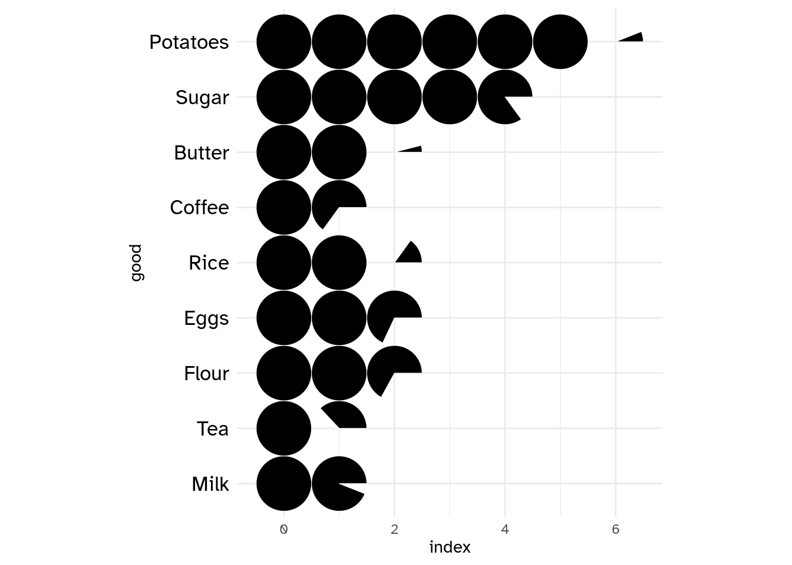

<!-- README.md is generated from README.Rmd. Please edit that file -->

# ggtricks <a href="https://abdoulma.github.io/ggtricks/"></a>

<!-- badges: start -->

[](https://CRAN.R-project.org/package=ggtricks)
[](https://app.codecov.io/gh/AbdoulMa/ggtricks?branch=main)
[](https://github.com/AbdoulMa/ggtricks/actions/workflows/R-CMD-check.yaml)
<!-- badges: end -->

**{ggtricks}** package is a collection of multiple `geom` presenting
data in the form of circle (for now, but many more to come and not just
circle oriented.) using `grammar of graphics` philosophy and Cartesian
coordinates system.

You have a lot of functions to make sector charts where circle is split
along its circumference, therefore each section is proportional to value
it represents.

- `geom_pie` Pie charts
- `geom_donut` Donut charts (Pie chart with a hole)
- `geom_slice` Part of Pie charts
- `geom_donut_slice` Part of Donut charts

You also have a function, `geom_series_circles()` to plot what I call
series of circles, which draws for a category as many circles and
fraction of circles as needed to represent the value represented by that
category. A companion function `geom_series_text` is defined to put
labels at the boundary of series circles because calculating these
boundary positions can be tedious depending on the starting angle of the
fragments of circles.

## Installation

You can install the stable version of ggtricks like so:

``` r
install.packages("ggtricks")
```

or the developpement version:

``` r
devtools::install_github("abdoulma/ggtricks")
```

## Examples

### `geom_series_circles`

- Basic Example

``` r
library(tidyverse)
library(ggtricks)

my_theme <- function(...) {
  theme_minimal() +
    theme(
      text = element_text(family = "Atkinson Hyperlegible"),
      axis.text.y = element_text(color = "black", size = rel(1.5))
    )
}
prod_df <- data.frame(
  good = c("Potatoes", "Sugar", "Butter", "Coffee", "Rice", "Eggs", "Flour", "Tea", "Milk"),
  index = c(606, 485, 204, 165, 215, 268, 267, 137, 194)
)

prod_df <- prod_df |>
  mutate(
    index = index / 100,
    good = fct_rev(fct_inorder(good))
  )

prod_df |>
  ggplot() +
  geom_series_circles(aes(index, good), color = "white") +
  coord_equal() +
  my_theme()
```



Of course, there is a `fill` mapping argument to drive each category
filling color.

``` r
prod_df |>
  ggplot() +
  geom_series_circles(aes(index, good, fill = good), color = "black", linewidth = 2.5) +
  coord_equal() +
  my_theme()
```


Of course, you can choose, to customize the categories labels by setting
`axis.text` in `theme_*()` function. But the need may come to add labels
at series of circles boundary positions. There comes
`geom_series_text()` function.

``` r
prod_df |>
  ggplot() +
  geom_series_circles(aes(index, good, fill = good), color = "black", linewidth = 2.5) +
  geom_series_text(aes(index, good, label = index), size = 6, family = "Atkinson Hyperlegible") +
  coord_equal(clip = "off") +
  guides(
    fill = "none",
  ) +
  my_theme()
```


You can set `init_angle` to define fragment of circle starting angle.

``` r
index_df <- tribble(
  ~article, ~index,
  "Plate beef", 187,
  "Bacon", 215,
  "Lard", 266
)

index_df <- index_df |>
  mutate(
    index = index / 100
  )

index_df |>
  ggplot() +
  geom_series_circles(aes(index, article),
    init_angle = 45
    # init_angle = 90
    # init_angle = 145
    # init_angle = 180
  ) +
  coord_equal() +
  theme_minimal()
```


- Two series of circles combination

Let’s illustrate a use of the combination of two series of circles with
another example from *Charts And Graphs (An introduction to graphics
methods in control and analysis of statistics)* by KARL G. KARSTEN, B.A.

``` r
usa_trades <- tribble(
  ~country, ~with_foreign, ~with_us,
  "United States", 13359, 13359,
  "United Kingdom", 15925, 3123,
  "Canada", 2304, 1256,
  "France", 7429, 1686,
  "Italy", 4189, 1516,
  "Netherlands", 2639, 316,
  "Japan", 2421, 1420,
  "Germany", 4966, 577
)

usa_trades <- usa_trades |>
  mutate(
    country = fct_rev(fct_inorder(country)),
    across(.cols = contains("with"), \(x) x / 1e3, .names = "{.col}")
  ) |>
  arrange(country) |>
  mutate(
    row_num = row_number()
  )

n_rows <- nrow(usa_trades)
usa_trades |>
  ggplot() +
  geom_series_circles(aes(with_foreign, country), fill = "white", color = "black", linewidth = 2) +
  geom_series_circles(aes(with_us, country)) +
  geom_text(aes(y = row_num, label = scales::comma(with_us)), x = -1, family = "Atkinson Hyperlegible", hjust = 1) +
  geom_text(aes(y = row_num, label = scales::comma(with_foreign)), x = -2, family = "Atkinson Hyperlegible", hjust = 1) +
  geom_text(aes(y = row_num, label = country), x = -3.5, family = "Atkinson Hyperlegible", fontface = "bold", hjust = 1) +
  annotate(geom = "text", x = -1, y = n_rows + 1, label = "Trade\n with\n U.S.", family = "Atkinson Hyperlegible", hjust = 1) +
  annotate(geom = "text", x = -2, y = n_rows + 1, label = "Total\n Foreign\n Trade", family = "Atkinson Hyperlegible", hjust = 1) +
  annotate(geom = "text", x = 8, y = n_rows + 1, label = "(Millions of Dollars)", family = "Atkinson Hyperlegible") +
  scale_x_continuous(
    limits = c(-5, 14)
  ) +
  coord_equal(clip = "off") +
  theme_minimal() +
  theme(
    axis.text = element_blank(),
    axis.title = element_blank(),
    panel.grid = element_blank(), 
    plot.background = element_rect(fill = "white", color = NA)
  )
```


### `geom_pie`

- `init_angle`

As with `geom_series_circles()`, you can set the init angle parameter to
set the starting angle of your pie (here the `pie`, but it is also
available for `donut`, `slice` and `donut_slice`.)

``` r
my_df <- data.frame(
  cat = paste0("Prod ", 1:4),
  val = c(87, 34, 21, 8)
)

categories_fills <- c(
  "Prod 1" = "#3E71EC",
  "Prod 2" = "#A9A9A9",
  "Prod 3" = "#7942A6",
  "Prod 4" = "#F7324B"
)
```

``` r
my_df |>
  ggplot() +
  geom_pie(aes(cat = cat, val = val, fill = cat),
    init_angle = 0
    # init_angle = 60,
    # init_angle = 120,
    # init_angle = 180
  ) +
  coord_equal() +
  scale_fill_manual(
    values = categories_fills
  ) +
  theme_minimal()
```


- `spotlight_max` & `spotlight_position`

If you want the category with the max value to determine the slices
positions, you can set the `spotlight_max` parameter to `true`. Then the
category with the max value will be placed at `spotlight_position` (by
default `top`, others possible values are: `right`, `bottom` and
`left`.)

``` r
my_df |>
  ggplot() +
  geom_pie(aes(cat = cat, val = val),
    spotlight_max = TRUE,
    spotlight_position = "top",
    # spotlight_position = "right"
    # spotlight_position = "bottom"
    # spotlight_position = "left"
  ) +
  coord_equal() +
  scale_fill_manual(
    values = categories_fills
  ) +
  theme_minimal()
```


- `spotlight_cat`

Maybe, you want a specific category to drive the slices positions rather
than the category with the maximum value ? Then come the `spotlight_cat`
parameter to define the driving category. Also here you can combine the
`spotlight_cat` parameter value with `spotlight_position` to specify its
position.

``` r
my_df |>
  ggplot() +
  geom_pie(aes(cat = cat, val = val, fill = cat),
    spotlight_cat = "Prod 1",
    spotlight_position = "top"
  ) +
  coord_equal() +
  scale_fill_manual(
    values = categories_fills,
    guide = "none"
  ) +
  theme_minimal()
```


- `labels`

As I know that it can be difficult to know the coordinates of the center
positions of the category slices, I define a default `label` mapping
which will place the provided labels at this position. When `label`
mapping is defined, you can define `labels_with_tick` parameter to
`TRUE` to add tick mark at the centers positions of the slices.

``` r
my_df |>
  ggplot() +
  geom_pie(
    aes(cat = cat, val = val, fill = cat, label = cat)
    # labels_with_ticks = TRUE
  ) +
  coord_equal() +
  scale_fill_manual(
    values = categories_fills,
    guide = "none"
  ) +
  theme_minimal()
```


### `geom_donut`

Donut is just pie with a hole in it. There are two parameters `r1` and
`r2` to define thickness of the donut.

``` r
my_df |>
  ggplot() +
  geom_donut(aes(cat = cat, val = val, fill = cat),
    r1 = 1, r2 = .65
    # r1 =  1 , r2 = .35
  ) +
  coord_equal() +
  scale_fill_manual(
    values = categories_fills,
    guide = "none"
  ) +
  theme_minimal()
```


All others parameters available for `geom_pie` are also here.

### `geom_slice`

It is a portion of pie, by default a half (180 deg). You can set the
`slice_angle` portion as needed.

``` r
my_df |>
  ggplot() +
  geom_slice(aes(cat = cat, val = val, fill = cat),
    slice_angle = 180 # ,
    # slice_angle = 120
  ) +
  coord_equal() +
  scale_fill_manual(
    values = categories_fills,
    guide = "none"
  ) +
  theme_minimal()
```


Also here, you can set the starting angle position with `init_angle`.
Note here that there are no `spotlight_max`, `spotlight_cat` parameters,
since we are not drawing a complete circle (but theoretically you can,
if you set `slice_angle` to 360, which means a `pie`.)

``` r
my_df |>
  ggplot() +
  geom_slice(aes(cat = cat, val = val, fill = cat),
    init_angle = 30 # ,
    # init_angle = 90
  ) +
  coord_equal() +
  scale_fill_manual(
    values = categories_fills,
    guide = "none"
  ) +
  theme_minimal()
```


You can however set the slice position with `slice_position`(possible
values are: `top`, `right`, `bottom`, and `left`). Soon, I will post
more detailed examples on the package website:
<https://abdoulma.github.io/ggtricks/>.

### `geom_donut_slice`

It is a slice of donut plot. As a `geom_donut`, it is driven by 2 radii
and as a slice plot, it has a defined slice angle.

``` r
my_df |>
  ggplot() +
  geom_donut_slice(aes(cat = cat, val = val, fill = cat),
    r1 = 1, r2 = .65
    # r1 = 1, r2  = .35,
    # slice_angle = 90
    # slice_angle = 120
    # slice_angle = 180
  ) +
  coord_equal() +
  scale_fill_manual(
    values = categories_fills,
    guide = "none"
  ) +
  theme_minimal()
```


`geom_slice_donut` also has special parameter `link_with_origin`, if you
want to connect the donut slice boundaries with origin.

``` r
my_df |>
  ggplot() +
  geom_donut_slice(aes(cat = cat, val = val, fill = cat),
    r1 = 1, r2 = .65,
    slice_angle = 120,
    slice_position = "top",
    link_with_origin = TRUE
  ) +
  coord_equal(clip = "off") +
  scale_fill_manual(
    values = categories_fills,
    guide = "none"
  ) +
  theme_minimal()
```


## Limitations

As you might have noticed, to generate circle, I use `coord_equal()`,
using `coord_cartesian()` will zoom the plot, not generating a appealing
circle shape even if the underlying drawn plot is a circle. So, we fix,
the `aspect ratio` to force :

> the physical representation of data units on the axes.

according to the official
[documentation](https://ggplot2.tidyverse.org/reference/coord_fixed.html).
Of course, you shouldn’t edit the default `ratio = 1` that ensures that
one unit on `x-axis` is the same length as one unit on the `y-axis`.

When using `geom_series_circles()`, the desire will come one day to
combine it with `facet_wrap()` or `facet_grid` or any faceting function,
**you should not**, or not the way you envision.

Since we are using `coord_equal()`, you won’t be able to set `scales`
parameter, which I strongly suspect you to try to do. So for the moment,
I advise you not to do so. However, I will provide some tips to go
through those restrictions on package website
<https://abdoulma.github.io/ggtricks/>

## Roadmap

In the coming weeks, additional features will be added to current
`geoms`:

- Detach spotlighted category
- Variate radii for the representation of categories
- Label displaying in mapping (choose categories we want to display)
- Special key draw for pie and slice and another one for `donut` and
  `donut_slice`.

As announced at start, I am not limiting the package to sector charts,
so additional `geom` styles will be added, and if you have suppositions,
fee free to open an issue, I am open to all contributions.
